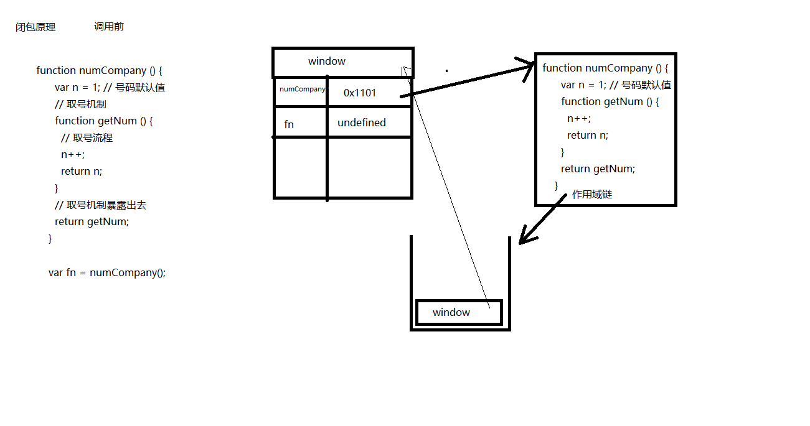
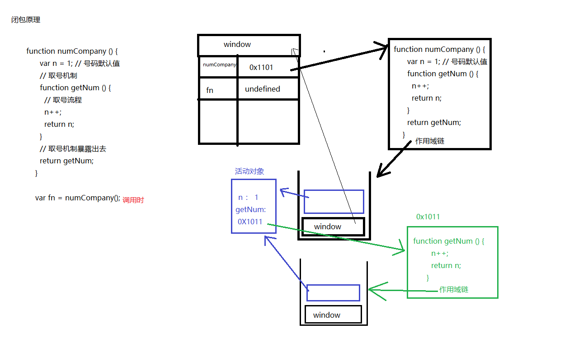
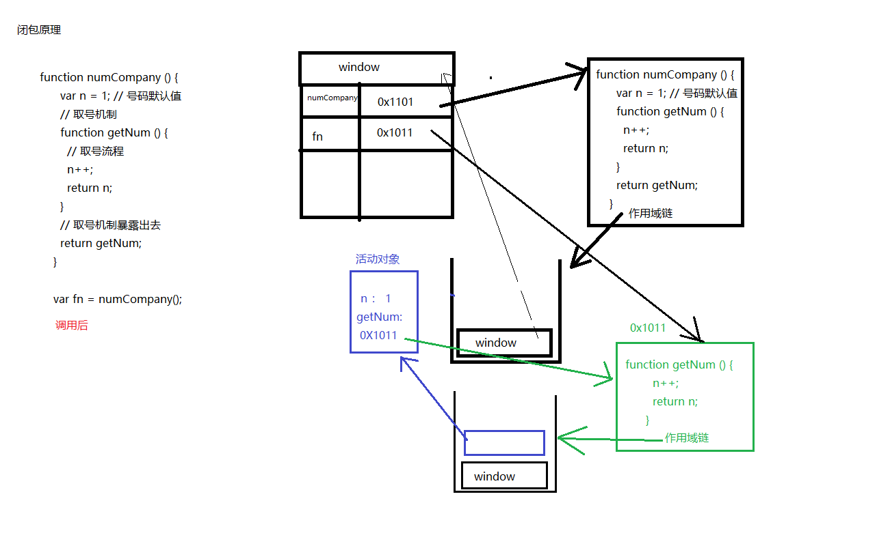

### 闭包closure

##### 函数对象

* 函数在创建的时候会创建两个对象

  一个是函数对象本身

  另一个是作用域链对象(未调用之前只有window在作用域链对象上)

* 函数调用执行时会创建一个活动对象，放到作用域链对象上，执行结束会销毁这个活动对象

##### 闭包解决问题

全局变量：函数体外定义的变量，每个函数都能修改，会造成全局污染

局部变量：在函数体内定义的变量，只有当前函数能使用，但是不能全局重复使用

需求：既能全局使用，又不会污染全局  ---闭包实现

##### 闭包步骤

1、外层函数嵌套内层函数

2、内层函数使用外层函数的局部变量

3、把内层函数作为外层函数的返回值

~~~javascript
//可以在全局操作另一个作用域的局部变量
function fn(){
    var num = 1;
    function foo(){
        num++;
        return num;
    }
    return foo;
}
var f1 = fn();//接收内层函数
var n = f1();//得到外层函数的变量
var m = f1();
//调用f1操作的是外层函数的局部变量num，属于同一个num
console.log(n,m);//2,3

//注意f1与f2操作的num不是同一个num
var f2 = fn();
~~~

##### 闭包原理

外层函数的活动对象不能被释放，缺点是占内存

###### numCompany调用前

window全局下存在numCompany函数，fn变量(变量提升undefined)，此时是numCompany函数执行前的状态

对于numCompany函数而言，存在函数体本身以及函数的作用域链对象，作用域链中只有window

###### numCompany调用时

numCompany函数执行时，产生其活动对象，并加入到其作用域链对象中。函数执行返回getNum函数给fn，故产生了getNum函数的函数体对象与作用域链对象，改作用域链包含window与外层函数numCompany活动对象

###### numCompany调用后

fn在内存中的值不再是undefine，得到fn函数对象本身(也是getNum函数体)的地址，numCompany()的活动对象出numCompany的作用域链，但是由于活动对象还有别的引用存在，故只出栈不销毁。

（fn存在，其指向的函数体存在，该函数体中指向的作用域链就存在，该作用域链中指向的活动对象就存在）

###### fn调用时

fn执行时，产生fn的活动对象(没有自己的变量为空)，并加入到fn函数的作用域链中。当执行n++时，先查看作用域链的顶部，即自己的活动对象中，没有n，在作用域链中往下一个找，找到外层函数NumCompany的活动对象，其中有n，则进行了n++,n=2

###### fn调用后

删除fn作用域链上的fn的活动对象，并销毁fn的活动对象。下次调用时又重复产生fn的活动对象，执行之后又销毁。但是每次找到的n都是在外层函数中的同一个n。

### 继承

继承是指两个类之间的关系，子类共享父类的属性和方法。js的继承都是基于原型实现的

面向对象：封装，继承，多态（重写，重载）

##### 原型链的继承

通过将构造函数的原型对象指针prototype指向一个由需要继承的构造函数生成的实例。

原型链：实例的\_proto_指向构造函数的prototype

Cat.prototype = new Animal();

~~~javascript
//基于原型链实现继承
function Animal(){//父类
    this.name = "animal";
    this.say = function(){
        console.log(this.name);
    }
}
Animal.prototype.eat = function(food){
    console.log(this.name +" is eating "+ food);
}
function Cat(){//子类
    //此处定义自己的name，使用时先在自己属性上查找name，没有再去继承的prototype上查找
    this.name = "cat";
}
//此时Cat将拥有Animal上所有的属性，并可以使用Animal对象原型上的所有方法
Cat.prototype = new Animal();//子类继承父类的属性与方法

//子类新增属性和方法必须在继承之后，因为在继承时改变了原有的prototype指向，原有对象原型的方法就无法访问
Cat.prototype.init = function(){}

var tom = new Cat();
tom.say();//cat
tom.eat("fish");//cat is eating fish

//instanceof判断tom是否是Animal的实例
console.log(tom instanceof Animal);//true
~~~

